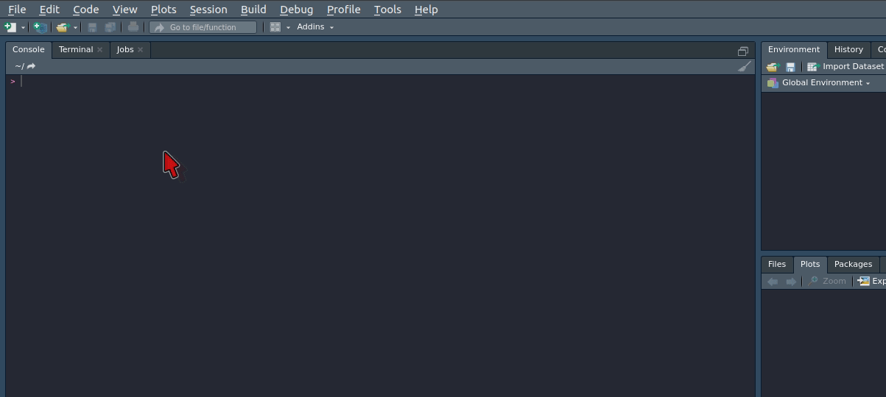

```{r setup, include=FALSE}
options(htmltools.dir.version = FALSE)
```

class: middle

<blockquote cite="http://www.worldwildlife.org/who/index.html">

"Wealth consists not in having great possessions, but in having few wants."

<p align="right"> Epicteto,<i> Filosofo Griego </i>.</p>

</blockquote>

---
class: center, inverse, middle

# Breve historia

---

background-image: url(http://hexb.in/hexagons/rmarkdown.png)
background-size: 80px
background-position: 97% 5%

# Paquete R Markdown

1. "R Markdown" como un tipo documento  tuvo su introducción en el paquete **knitr** a principio del 2012.

2. La idea principal es poder incluir "trozos" (*chunks*) de codigo (R o cualquier otro lenguaje).

3. La versión original de Markdown, inventada por [John Gruber](https://en.wikipedia.org/wiki/Markdown) era 
relativamente sencilla y sin la capacidad de escribir documentos técnicos (tablas, notas al pie, expresiones
matemáticas o citar).
   
4. John MacFarlane creó Pandoc,  un convertidor universal de documentos, con la habilidad de convertir desde multiples formatos (Markdown, reStructuredText, textile, HTML, DocBook, Microsoft Word docx, LibreOffice ODT, EPUB y muchos más). Por eso en la comunidad se dice que pandoc es la navaja suiza de los formatos, se instala en conjuntO con RStudio.

5. En resumen R Markdown es la suma de **knitr** + Pandoc.

---

class: center, inverse, middle

# Elementos básicos

---
# Compilar un documento R Markdown

Existen dos formas usuales de compilar:

1. Click en el botón `knit`.

2. Keyboard shortcuts:
  
  - Windows/Linux: `Ctrl + Shift + K`.
  - MacOs: `Cmd + Shift + K`.

3. Atrás de todo esto, RStudio llama la función `rmarkdown::render()`. Veamos el ejemplo que por default viene con RStudio.

---
# Formatos de Salida

1. Existen dos grandes tipos de formatos de salidas en el paquete R Markdown: 
  
  - Documentos 
  - Presentaciones.
  
```{r, out.width="70%", fig.align='center', echo = FALSE}

```

---
# YAML 

YAML se define como un formato de serialización (proceso de codificación de un objeto en un medio de almacenamiento, en este caso metadata), El encabezado YAML 
es un conjunto de pares llave:valor al comienzo de tu archivo. Comienza y 
termina el encabezado con tres lines punteadas (- - -).

```r
---
title: "Mi primer R Markdown"
author: "Luke Skywalker"
date: "25 de Marzo del 2019"
* output: pdf_document
---
``` 

---
# Syntaxis de Markdown: Block-level 

Los niveles de las secciones se escriben después de simbolo # o *hashtag*,
e.g:

```r
# Sección 
## Subsección
### Subsubsección
``` 
Si no se quiere que el nivel de sección tenga número, e.g:

```r
# Prefacio {-}
``` 
Listas no enumeradas comienzan con `*`, `-` o `+`, si se quiere crear una sublista se debe seguir **la regla de los cuatro espacios**, e.g:

.pull-left[
* lista no ordenada
* item 2
    + sub-item 1
    + sub-item 2
]


.pull-right[
1. lista ordenada
2. item 2
    + sub-item 1
    + sub-item 2 
]

---
# Syntaxis de Markdown: Formato inline

Los siguientes son syntaxis de markdown, que son validas algunas con asterisco o guión bajo:

- **negrita**: `**texto**` o `__texto__`.
- *itálica* : `*texto*` o `_texto_ `.
- Texto con ~ realiza un subíndice, e.g. `H~2~O~2~`.
- Texto con ^ realiza un supraíndice, e.g. `Cu^2+^`. 
- Hyperlink: `[text](link)` e.g. `[RStudio](https://www.rstudio.com)`.
- Insertar imagen: ``

---
# Syntaxis de Markdown: Expresiones Mat.

Expresiones *inline* : Con `$f(k) = {n \choose k} p^{k} (1-p)^{n-k}$` obtenemos $f(k) = {n \choose k} p^{k} (1-p)^{n-k}$. 

Si queremos un `display` usamos doble  `$$`, e.g: 

$$ 
f(k) = {n \choose
k} p^{k} (1-p)^{n-k}
$$

Finalmente se puede usar "ambiente" matemático.

```r
$$
\Theta = \begin{pmatrix}\alpha & \beta\\
\gamma & \delta
\end{pmatrix}
$$
```

En Html se usa [Mathjax](https://www.mathjax.org/) en la compilación y no una distribución $\TeX$.

---
class: center, inverse, middle

# R code chunks & inline R code

---

# R code chunks & inline R code

Se puede insertar un *R code chunk* usando:

1. La barra de herramienta de RStudio (botón `insert`).

2. Keyboard shortcuts:

    - Windows/Linux: `Ctrl + Alt + I`.
    - MacOs: `Cmd + Option + I`.

Los *chunks* son apoyados por opciones, tales como:

1. `eval`: Evalua el chunk.
2. `echo`: Muestra el código fuente.
3. `warnings` y `message`: Permite suprimir el mensaje o bien la advertencia, se usa con `TRUE` o `FALSE`. 

Si cierta opción la necesitamos usar con frecuencia, se puede configurar globalmente.

---
class: center, inverse, middle

# Formato de Salida: Documento PDF

---

## Output documento PDF 

Para crear un documento pdf desde R Markdown, se debe especificar `pdf_document()` en el YAML. Acá podemos usar $La\TeX$, crear macros o incluir template personalizado.

## Tabla de contenido

Para agregar la tabla de contenido con profundida:

```r
---
title: "Habits"
output:
  pdf_document:
    toc: true
    toc_depth: 2
---
```

Para enumerar las secciones usamos `number_sections: true`. Para aquellos que estén familiarizado con $La\TeX$ esto significa `\section{}` y con `false` igual a `\section*{}`.

---

## Opciones de Figura

```r
---
title: "Habits"
output:
  pdf_document:
    fig_width: 7
    fig_height: 6
    fig_caption: true
---
```
## Print Data Frame

| Opción  | Descripciones                |
|---------|------------------------------|
| default | "llama" `print.data.frame()` |
| Kable   | usa `knitr::kable()`         |
| tibble  | usa `tibble::print.tbl_df()` |


---

## Opciones $La\TeX$ 

| Variable                               | Descripción                                               |
|----------------------------------------|-----------------------------------------------------------|
| lang                                   | Document language code                                    |
| fontsize                               | Font size (e.g., 10pt, 11pt, or 12pt)                     |
| documentclass                          | LaTeX document class (e.g., `article`)                    |
| classoption                            | Options for documentclass (e.g., `oneside`)               |
| geometry                               | Options for geometry class (e.g., `margin=1in`)           |
| mainfont, sansfont, monofont, mathfont | Document fonts (works only with `xelatex` and `lualatex`) |
| linkcolor, urlcolor, citecolor         | Color for internal, external, and citation links          |

Van en el espacio antes del output.


---
class: center, inverse, middle

# Material de Apoyo 
---

# Recomendaciones 

Resumenes:

1. Todas las opciones de los *R code chunk* se encuentran en la página web personal de su 
autor [Yihui Xie](https://yihui.name/knitr/options). 

2. RStudio ha ido creado *cheat sheets*, el que incluye una página de [R Markdown](https://www.rstudio.com/resources/cheatsheets/).

Libros basados en R Markdown de [Yihui Xie](https://yihui.name/en/):

1. [R Markdown: Definitive Guide](https://bookdown.org/yihui/rmarkdown/)

2. [Bookdown: Authoring Books and Technical Documents with R Markdown](https://bookdown.org/yihui/bookdown/)

3. [Blogdown: Creating Websites with R Markdown](https://bookdown.org/yihui/blogdown/)

---
# Videos  `r fontawesome::fa("youtube", fill = "#ee5863")` 

 `r fontawesome::fa("link", fill = "green")` [Parte 1: Preliminares](https://youtu.be/x402qUhrO9g)   

 `r fontawesome::fa("link", fill = "green")` [Parte 2: Elementos Básicos](https://youtu.be/jonFm1p6CNU)

 `r fontawesome::fa("link", fill = "green")` [Parte 3: R Code Chunk](https://youtu.be/-5Yw46YcIr0)

 `r fontawesome::fa("link", fill = "green")` [Parte 4: Documento PDF](https://youtu.be/dZvPS2YTST4)  

---

class: center, middle

# Muchas Gracias

<iframe src="https://giphy.com/embed/FpZvxELO5xE8QcFdoc" width="480" height="247" frameBorder="0" class="giphy-embed" allowFullScreen></iframe><p><a href="https://giphy.com/gifs/oscars-academy-awards-oscars-2019-FpZvxELO5xE8QcFdoc"></a></p>

Slides creadas por la librería de R [**xaringan**](https://github.com/yihui/xaringan).

El chakra proviene [remark.js](https://remarkjs.com), [**knitr**](http://yihui.name/knitr), y [R Markdown](https://rmarkdown.rstudio.com).
